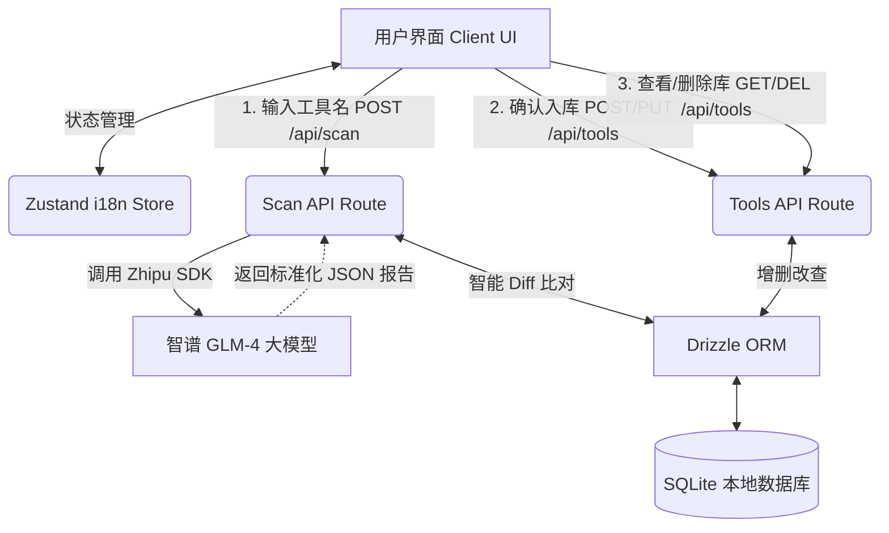

# ComplianceOS 系统架构设计文档

## 1. 项目概述

**ComplianceOS** 是一款由 AI 驱动的企业级软件合规性分析与管理全栈应用。
它旨在帮助企业 IT 与法务团队快速识别外部工具（如 Docker, Redis 等）的商业使用限制、开源协议变更以及潜在的合规风险。系统通过大语言模型自动生成结构化的扫描报告，并提供存量工具库的版本差异比对与管理功能。

## 2. 核心技术栈 (Tech Stack)

本项目遵循 `opencode` 最佳实践，采用现代化、高性能的 Node.js 替代方案与轻量级数据栈：

- **运行时与包管理**: Bun (极速 I/O 与包管理)
- **全栈 Web 框架**: Next.js 15 (App Router) + React 19
- **前端样式与 UI**: Tailwind CSS v4 (样式) + Lucide React (图标)
- **状态管理与 i18n**: Zustand (通过 LocalStorage 持久化实现中英双语无缝切换)
- **数据库**: SQLite (本地文件型，轻量高效)
- **ORM 框架**: Drizzle ORM + `@libsql/client` (类型安全，Schema 优先)
- **AI 大模型服务**: 智谱 GLM-4 (通过 `zhipuai` SDK 调用)

## 3. 系统架构与数据流 (Architecture & Data Flow)

系统采用经典的前后端分离结构，但统一在 Next.js 的工程生态中闭环：

## 4. 核心模块说明

### 4.1. 前端工作台 (Workspace UI)

- **状态隔离**: 页面由 `Scan` (扫描工作台) 和 `Repo` (信息库) 两个主要选项卡组成。
- **多语言基座**: 依赖 `Zustand` 注入 `zh/en` 字典，实现 UI 层（包含接口提示）的全量实时国际化。
- **智能交互卡片**: 接收 AI 返回的数据后，前端组件会根据 `isNew` (全新工具) 和 `hasDifferences` (数据有差异) 标志位，渲染不同的操作按钮（如“全新入库”、“更新差异”、“忽略”）。差异内容会使用醒目的 Diff UI（Current DB ➔ New Scan）展示。

### 4.2. AI 扫描引擎 (AI Scan Engine)

- **Prompt Engineering**: 位于 `src/lib/ai/zhipu.ts`。通过精准的 Prompt，约束 GLM-4 模型将内部的工具知识（特别是官网服务条款 TOS）转化为严谨的、包含 7 个固定字段的纯 JSON 数组。
- **异常拦截**: 设置 `temperature: 0.1` 确保输出稳定性，包含正则处理逻辑以剥离大模型有时会附带的 Markdown 代码块（`json `）。

### 4.3. 后端服务与路由 (API Routes)

全部位于 `src/app/api/` 下的 Serverless/Route Handlers 结构：

- **`POST /api/scan`**:
  - **职责**: 连接 AI，执行“AI分析 + 本地查重比对”的复合业务。
  - **Diff 算法**: 拿到 AI 报告后，立即在 SQLite 中通过 `IN` 语句查询同名工具。如果找到匹配项，逐个对比 `version`, `license`, `risk_analysis` 等关键字段，生成 `differences` 对象返回给前端。
- **`GET /api/tools`**: 查询并按字母正序/倒序返回所有已保存的合规工具信息。
- **`POST /api/tools`**: 将全新扫描的工具实体写入数据库，通过 `nanoid` 生成唯一主键。
- **`PUT /api/tools/[id]`**: 接收差异确认结果，动态过滤掉 `undefined` 字段，更新特定工具。
- **`DELETE /api/tools/[id]`**: 删除数据库中的废弃工具记录。

## 5. 数据库设计 (Schema Design)

遵循 `snake_case` 命名法，核心实体 `tool` 定义于 `src/db/schema.sql.ts`。

| 字段名 (Column)         | 类型 (Type) | 约束 (Constraints) | 描述 (Description)                 |
| :---------------------- | :---------- | :----------------- | :--------------------------------- |
| `id`                    | TEXT        | Primary Key        | 主键 (Nanoid)                      |
| `name`                  | TEXT        | Not Null, Unique   | 工具名称 (如 Docker Desktop)       |
| `version`               | TEXT        | Not Null           | AI 识别的当前主要版本              |
| `license`               | TEXT        | Nullable           | 许可协议 (如 RSALv2, MIT 等)       |
| `company`               | TEXT        | Nullable           | 归属公司或组织                     |
| `usage_restrictions`    | TEXT        | Nullable           | 商业使用规模或场景限制             |
| `risk_analysis`         | TEXT        | Nullable           | 潜在法务、财务等合规风险分析       |
| `alternative_solutions` | TEXT        | Nullable           | 推荐的纯开源平替方案               |
| `created_at`            | INTEGER     | Not Null           | 创建时间戳 (ms)                    |
| `updated_at`            | INTEGER     | Not Null           | 最近一次更新/Diff确认的时间戳 (ms) |

## 6. 扩展性与未来演进建议 (Future Roadmap)

1.  **联网检索能力增强**: 当前 AI 数据基于模型已有训练权重（支持一定的 Web Search），未来可引入独立的搜索引擎 API (如 Tavily/Google Search) 先抓取最新 TOS 文本，再交由 GLM 分析（RAG 模式），以应对频繁修改协议的软件（如 Redis、Elasticsearch）。
2.  **团队协作 (Auth)**: 引入 NextAuth.js，为合规分析报告添加“处理人/审批人”字段。
3.  **定期巡检 (Cron Jobs)**: 配置后台定时任务，定期自动将库里的工具名称送入 AI 引擎重新扫描，一旦发现协议变动，主动向管理员发送邮件飞书告警。
